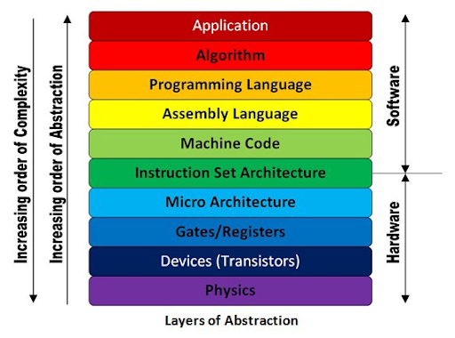

# lesson-1 notes

## Course Overview
- General Course guidelines are in the repo called syllabus.

## Computers and Programming Languages


 
## How to access the terminal
- Linux, press `Ctrl+Alt+T`.
- Mac
  1. Press `⌘+space`.
  2. Search for and open `terminal`.
  3. (Optional) Install *iTerm2* for a better experience.
- Windows
  - Use [Cygwin](https://www.cygwin.com/) which you can download directly [here](https://www.cygwin.com/setup-x86_64.exe)
   1. Choose all default options.
   2. When it asks you to choose a download site, pick any.
   3. When it asks you to select packages, search for `gcc-g++`, navigate into
`All` -> `Devel` -> `gcc-g++` and select the latest version from the dropdown
   4. Now search for `make`, navigate to `All` -> `Devel` -> `make` and select the
latest version
   5. Now search `python`, navigate to `All` -> `Python`.  Select the latest
versions for `python39`, `python39-devel`, `python39-pip`,
`python39-setuptools`, and `python39-virtualenv`.
   6. Search for vim, and add the latest package
   7. In the terminal do ```cd "C:\users"``` to see your personal user account, documents, downloads...
 
 
 ## Unix Commands 

| **Command**               | **Description**                                                                                                                                            |
|---------------------------|------------------------------------------------------------------------------------------------------------------------------------------------------------|
| man                       | shows you the man(ual) page of the command                                                                                                                 |
| cd                        | change directory                                                                                                                                           |
| cd ..                     | go back a directory                                                                                                                                        |
| mkdir                     | make directory                                                                                                                                             |
| pwd                       | tells you where you currently are                                                                                                                          |
| ls                        | list directories                                                                                                                                           |
| ls -l                     | lists your files in a long format                                                                                                                          |
| ls -a                     | lists all files including those that begin with a dot                                                                                                      |
| ls -latrh                 | lists all files in long format, in reverse order of the modification time, in human-readable form (use man to read more)                                   |
| mv filename1 filename2    | moves a file; also renames a file                                                                                                                          |
| cp filename1 filename2    | copies a file                                                                                                                                              |
| rm filename               | removes a file                                                                                                                                             |
| rm -rf *                  | removes everything!! Make sure you back things up; we will do that later with Github Note: * is a wildcard                                                 |
| diff filename1 filename2  | diffs 2 files                                                                                                                                              |
| wc filename               | tells you how many lines, words, and characters are in a file                                                                                              |
| chmod options filename    | changes the read, write, and executable access for a file If you're lazy, you can always do chmod 777 filename to enable all access for all types of users |
| touch filename            | creates a blank file or updates the timestamp of the file touched                                                                                          |
| ff                        |  find files anywhere on the system                                                                                                                         |
| grep string filename      | looks for a string in the files in the directory Note: there are many useful flags that you can use to make this stronger; see man grep                    |

Other useful commands:
* `.`: The **working directory**
* `..`: The **parent** of the working directory
* `~`: The **home** directory.
* `-`: The **previous** working directory


## Editors and Shell Scripts
We will use vim for this class to write our programs. In future classes, we will look into other editors such as VScode.
Vim commands:
  - vim filename -- to start editing a file with vim
  - ESC :w -- write/save the file
  - ESC i -- insert before the character
  - ESC a -- insert after the character
  - ESC :q -- quit vim
  
Basic Bash Shell Script called **unix_commands.sh**:
```
#!/bin/bash

mkdir new_folder
cd new_folder
touch new_file.txt
ls
```

Running a Bash Script in terminal:
```
chmod 777 unix_commands.sh
./unix_commands.sh
```

## Writing Hello World
- Create the file hello.c: ```vim hello.c```
- Enter the file and edit the contents of the file:
  ```
  #include <stdio.h>
  int main()
  {
    printf("Hello, World\n");
    return 0;
   }
  ```
 - Save and exit the vim editor: ```ESC :wq```
 - Compile the program: ```gcc hello.c```
 - Run the program: ```./a.out```


## Github

### Setting up Gtihub
Download git from here: https://git-scm.com/downloads
  - Create a github account.
  - Open terminal, and set your username: 
  ```
      git config --global user.name "John Doe"
      git config --global user.email johndoe@example.com 
  ```
  - Set up your ssh key:
    - [Generate a new key](https://docs.github.com/en/authentication/connecting-to-github-with-ssh/generating-a-new-ssh-key-and-adding-it-to-the-ssh-agent#generating-a-new-ssh-key)
      - Run the following command and then press enter to store the file in the default location. 
      ```
      ssh-keygen -t ed25519 -C "your_email@example.com"
      ```
    - [Add ssh key](https://docs.github.com/en/authentication/connecting-to-github-with-ssh/adding-a-new-ssh-key-to-your-github-account#adding-a-new-ssh-key-to-your-account)
      -  Run the following command to copy the key to your clipboard. Then paste this key into your account settings. 
      ```
      pbcopy < ~/.ssh/id_ed25519.pub
      ```
### Creating a branch
```
git checkout -b helloBranch
```
Copy your hello.c file into the directory and add and commit it with the commands shown bellow. Git status helps you see what files have been added, committed or pushed to origin.
```
git add hello.c
git status
git commit -m "first commit"
git status
```
Now push your branch to github:
```
git push origin helloBranch
```

### Merge branch to main
- To merge the new branch (helloBranch) into main, click on "Create pull request"
- Now that the PR (pull request) is created, we can review the code and add comments.
- Click "Merge pull request" to merge helloBranch into main.
  
## Homework:
  - Go to the hw link (https://classroom.github.com/a/MGFbjjfd) and make a team
  - In your terminal, clone the repo: ```git clone <link>```
  - Answers the questions in the readme file
  - push the main branch to github: ```git push origin main```
  
### Homework Help:
If you are having difficulty setting up the terminal on your computer (difficulty downloading cygwin, using github, ...), feel free to use Replit. I have attached a screen recording of how you can set up Replit, as well as doing the first couple steps of the homework.
https://www.dropbox.com/s/kbdfsaghk53xkay/Replit_Setup.mov?dl=0 

Here is a video on how to do the first couple steps of the assignment, and push your changes to github:
https://www.dropbox.com/s/bjp014tifv7p3yv/SubmittingHomework.mov?dl=0  
